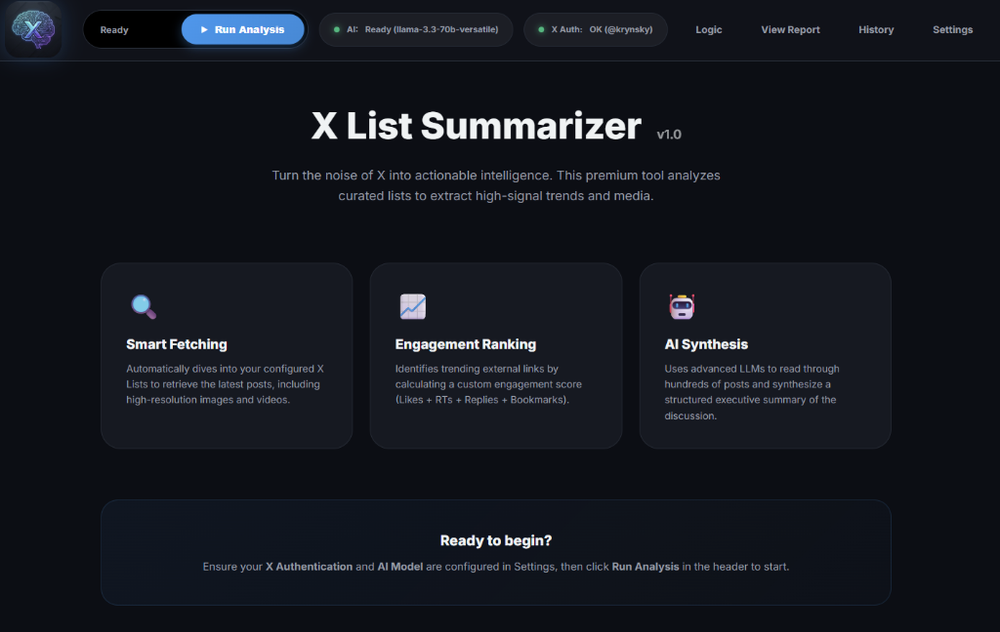
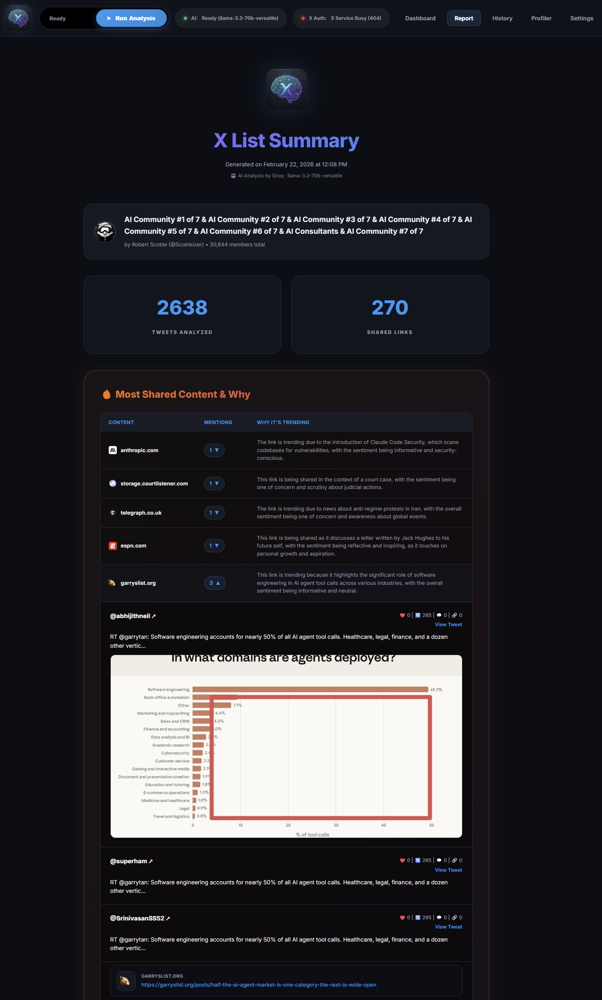

# X List Summarizer

> 🤖 AI-powered summarization of X/Twitter lists with multi-LLM support

A Pinokio application that fetches tweets from X/Twitter lists (both public and private), aggregates them by shared links, and generates beautiful AI-powered summaries using your choice of LLM backend.

<p align="center">
  <br>
  
</p>

## ✨ Features

- **🚀 Unified Dashboard**: A premium, dark-mode web interface to manage everything.
- **📋 Public & Private Lists**: Access both public and private X lists.
- **🔐 Persistent Sessions**: Log in once via browser cookies, verified automatically.
- **🧬 Native Link Previews**: X-style cards (Title, Image, Description) rendered directly in the report for external links.
- **📦 Multi-LLM Support**:
    - **Local**: Ollama, LM Studio
    - **Cloud**: Groq (Free), Anthropic Claude, OpenAI
- **⚡ Groq Support**: Ultra-fast inference with Llama 3 models on Groq.
- **🌐 Website Favicons**: High-quality website icons for shared links in the "Most Shared Content" section.
- **🔗 Smart Aggregation**: Groups tweets by shared external links to find trending stories.
- **🎥 Enhanced Media**: Built-in video player with improved playback and deduplication.
- **🎨 Premium Reports**: Generates responsive, self-contained HTML reports with modern CSS (Inter font, Glassmorphism).
- **🚦 Robust Health Checks**: End-to-end verification for both X Authentication and AI Provider connectivity.

## 📦 Installation

### Via Pinokio

1. Open Pinokio
2. Click the **+ Create** button
3. Paste this repository URL: `https://github.com/krynsky/x-list-summarizer`
4. Click **Create**

## 🚀 Usage

### 1. Open Dashboard
Click **Open Dashboard** in Pinokio. This launches the unified web interface.

### 2. Configure Settings
Go to the **Settings** tab in the dashboard:
- **X Authentication**: Paste your `auth_token` and `ct0` cookies (instructions provided in UI).
- **AI Intelligence**: Select your provider and configure the model/API key.
    - *Groq is recommended for free, high-speed cloud inference.*
- **Twitter Lists**: Add the URLs of the lists you want to summarize.

### 3. Run Analysis
Go to the **Dashboard** tab and click **Run Analysis**.
- The app will fetch tweets, aggregate links, and generate a summary.
- Progress is shown in real-time with detailed status updates.

### 4. View Report
Once complete, the report opens automatically. You can also view past reports in the **History** tab.

## 🛡️ Security

> [!WARNING]
> Your authentication cookies (`auth_token`, `ct0`) and AI API keys are highly sensitive.

- **Never share your `config.json`** or the contents of your `browser_session/` folder.
- The `.gitignore` in this repository is pre-configured to exclude these files from being committed to GitHub.
- If you suspect your session has been compromised, log out of X.com on all devices to invalidate the cookies.

## 🤖 AI Summarization Logic

1.  **AI Global Summary**: The application constructs a context window containing the most "high signal" data. It sends a structured system prompt to find themes and consensus opinions.
2.  **Top Shared Links**: Grouped tweets that share the exact same URL. Ranked by a Total Engagement Score (Likes + RTs + Replies + Quotes + Bookmarks).
3.  **Conversational Tweets**: Captures the "chatter" that doesn't involve external links, displayed in reverse chronological order.

## 🛠️ Tech Stack

- **Platform**: [Pinokio](https://pinokio.computer)
- **Language**: Python 3.10+
- **X API Client**: [Twikit](https://github.com/d60/twikit)
- **AI SDKs**: `openai`, `anthropic`
- **Frontend**: Custom HTML5/CSS3 Dashboard

## 📁 Project Structure

```
x-list-summarizer/
├── pinokio.js              # Pinokio manifest
├── install.js              # Installation script
├── run.js                  # App launcher
├── app/
│   ├── web_ui.py           # Main Unified Dashboard
│   ├── x_list_summarizer.py # Core logic (Fetching, Reporting)
│   └── llm_providers.py    # LLM Integration layer
├── browser_session/        # [PRIVATE] Saved cookies (cookies.json)
├── output/                 # [PRIVATE] Generated HTML reports
├── config.json             # [PRIVATE] App configuration
└── config.example.json     # Template for setup
```

---

**Made with ❤️ for the Pinokio and X.com community**
