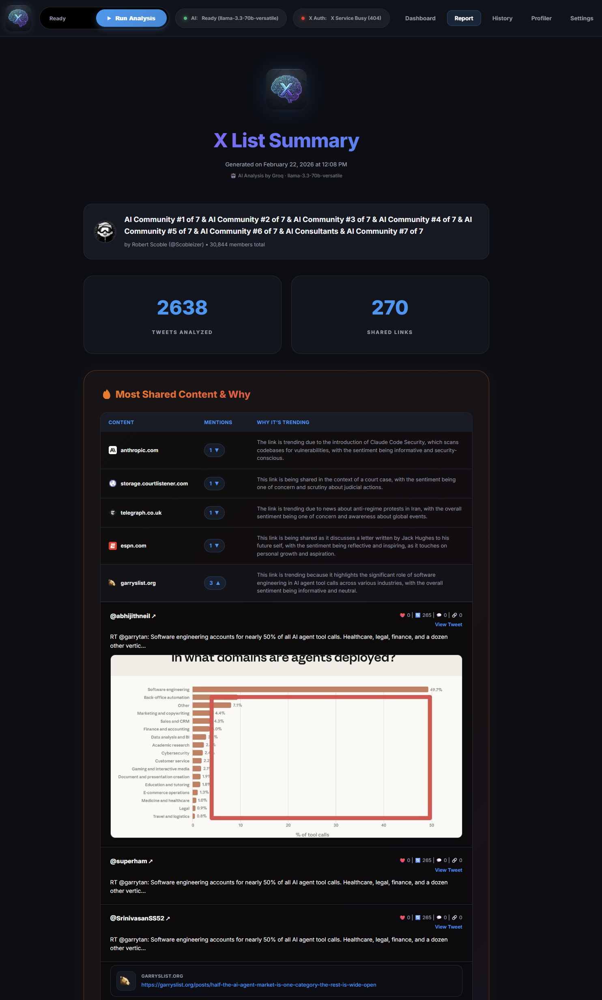
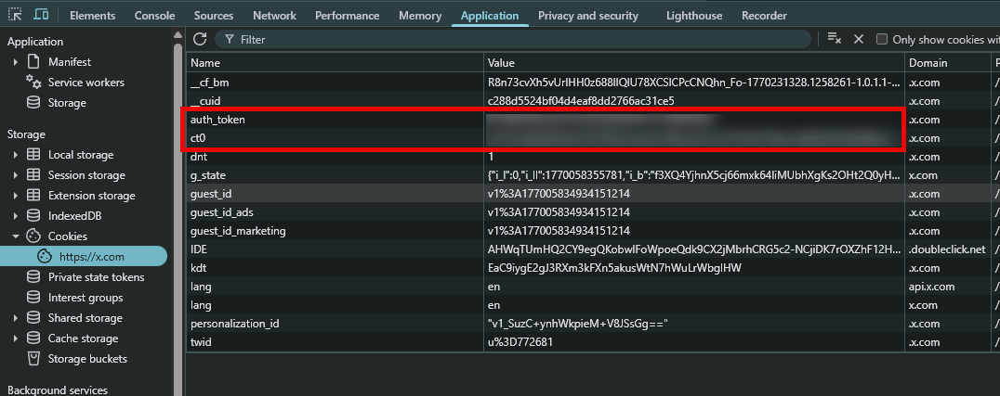

# X List Summarizer

> 🤖 **v1.8.0** — AI-powered summarization of X/Twitter lists with multi-LLM support

A [Pinokio](https://pinokio.co/) application that fetches tweets from X/Twitter lists (both public and private), aggregates them by shared links, and generates beautiful AI-powered summaries using your choice of LLM backend.

<p align="center">
  
</p>

## ✨ Features

- 🚀 **Unified Dashboard**: A premium, dark-mode web interface to manage everything.
- **🔀 Dual Fetch Modes (NEW in 1.8)**: Switch on the Settings page between free **Browser Session (twikit)** and the **Official X API v2** (paid, stable). API mode uses a Bearer Token, runs against `api.x.com/2/lists/:id/tweets`, and survives X's homepage changes that periodically break scrapers. Estimated cost at pay-per-use pricing (~$0.001/request): pennies to a few dollars per month for typical workloads.
- **🗞️ Compact Tweet Grid (NEW in 1.8)**: The "Other Relevant Tweets" section now renders as a 3-column grid of compact cards (responsive down to 1 column on mobile), keeping the report dense and scannable while still showing media and link previews when available.
- **🔍 Per-Link AI Insights**: Each link in the report now receives its own unique AI-generated summary instead of sharing a domain-level summary. Insight lookups use a prioritized exact-URL → truncated URL → domain → base-domain matching chain.
- **⚖️ Multi-Author Link Scoring**: Link rankings are now boosted when the same URL is shared by multiple unique authors, surfacing true community consensus over single-user spam. A per-author cap prevents any one curator from dominating the results.
- **🔗 Smart Session Resilience**: X's transient 404 authentication errors are now gracefully handled — the app proceeds with loaded cookies and retries automatically rather than failing the session.
- **🧮 Weighted Power Scoring**: Engagement rankings factor in **Bookmarks and Quotes** alongside Likes, RTs, and Replies.
- **🔄 Deep Recursive Extraction**: Upgraded engine to recursively scan **Retweets and Quote Tweets**, capturing links even when shared indirectly.
- **🧠 Integrated Methodology**: A new "Under-the-Hood" section in Settings with a collapsible guide to scoring, logic, and media handling.
- **🤖 xAI Grok Integration**: Official support for Grok-3, Grok-2, and Grok-beta via OpenAI-compatible endpoints.
- **🎞️ Intelligent Media Handling**:
    - **Deduplication**: Cluster-aware logic to prevent duplicate media in retweet chains.
    - **Reliable Videos**: Clickable high-res thumbnails that proxy to the source tweet for 100% playback success.
- **🔍 Account Profiler**: Analyze account personas using interactive word clouds and detailed list membership drill-downs.
- **📊 Report Transparency**: Every report now explicitly labels the **AI Provider and Model** used for the analysis.
- **📋 Public & Private Lists**: Access both public and private X lists.
- **🔐 Persistent Sessions**: Log in once via browser cookies, verified automatically.
- **🧬 Native Link Previews**: X-style cards (Title, Image, Description) rendered directly in the report for external links.
- **📦 Multi-LLM Support**:
    - **Local**: Ollama, LM Studio
    - **Cloud**: Groq (Free), Anthropic Claude, OpenAI, xAI Grok, DeepSeek, OpenRouter
- **⚡ Groq Support**: Ultra-fast inference with Llama 3 models on Groq.
- **🌐 Website Favicons**: High-quality website icons for shared links in the "Most Shared Content" section.
- **🔗 Smart Aggregation**: Groups tweets by shared external links to find trending stories.
- **🎨 Premium Reports**: Generates responsive, self-contained HTML reports with modern CSS (Inter font, Glassmorphism).
- **🛡️ Account Protection**: Smart User ID caching and randomized request staggering to stay within X rate limits.
- **🚀 Turbocharged Install**: Powered by `uv` for near-instant package installation and environment setup.
- **🏥 Robust Health Checks**: End-to-End verification for X Auth and AI Provider health.

## 📦 Installation

### Via [Pinokio](https://pinokio.co/)

1. Open [Pinokio](https://pinokio.co/)
2. Click the **+ Create** button
3. Paste this repository URL: `https://github.com/krynsky/x-list-summarizer`
4. Click **Create**

## 🚀 Usage

### 1. Open Dashboard
Click **Open Dashboard** in Pinokio. This launches the unified web interface.

### 2. Configure Settings
Go to the **Settings** tab in the dashboard:
- **X Authentication — Fetch Method**: Pick how the app talks to X.
    - **Browser Session (twikit)** — free, paste `auth_token` and `ct0` cookies. May break when X changes internals; violates X's ToS.
    - **Official X API v2** — paid but stable. Paste a Bearer Token from [developer.x.com](https://developer.x.com/en/portal/dashboard). Public lists only. Pay-per-use (~$0.001/request) typically costs pennies/month.

    > **How to find the cookies (twikit mode)?**
    > 1. Open [x.com](https://x.com) in your browser (Chrome/Edge/Brave).
    > 2. Press **F12** to open Developer Tools.
    > 3. Go to the **Application** tab. (Or **Storage** in Firefox)
    > 4. Expand **Cookies** on the left and select `https://x.com`.
    > 5. Find `auth_token` and `ct0` in the list and copy their values.
    >
    > 

- **AI Intelligence**: Select your provider and configure the model/API key.
    - *Groq is recommended for free, high-speed cloud inference.*
- **Twitter Lists**: Add the URLs of the lists you want to summarize.

### 3. Run Analysis
Go to the **Dashboard** tab and click **Run Analysis**.
- The app will fetch tweets, aggregate links, and generate a summary.
- Progress is shown in real-time with detailed status updates.

### 4. Profile Accounts
Go to the **Profiler** tab:
- Enter a X username to analyze their community-curated persona.
- Explore the interactive word cloud to see how they are categorized.
- Click any word to see the exact lists that contributed to that theme.

### 5. View Report
Once complete, the report opens automatically. You can also view past reports in the **History** tab.

## 🛡️ Security

> [!WARNING]
> Your authentication cookies (`auth_token`, `ct0`) and AI API keys are highly sensitive.

- **Never share your `config.json`** or the contents of your `browser_session/` folder.
- The `.gitignore` in this repository is pre-configured to exclude these files from being committed to GitHub.
- If you suspect your session has been compromised, log out of X.com on all devices to invalidate the cookies.

## 🤖 AI Summarization Logic

1.  **AI Global Summary**: The application constructs a context window containing the most "high signal" data. It sends a structured system prompt to find themes and consensus opinions.
2.  **Top Shared Links**: Grouped tweets that share the exact same URL. Ranked by a Total Engagement Score (Likes + RTs + Replies + Quotes + Bookmarks).
3.  **Conversational Tweets**: Captures the "chatter" that doesn't involve external links, displayed in reverse chronological order.

## 🛠️ Tech Stack

- **Platform**: [Pinokio](https://pinokio.co/)
- **Language**: Python 3.10+
- **X Backends**: [Twikit](https://github.com/d60/twikit) (cookie mode) **or** Official [X API v2](https://docs.x.com/x-api) via Bearer Token (1.8+)
- **AI SDKs**: `openai`, `anthropic`
- **Frontend**: Custom HTML5/CSS3 Dashboard

## 📁 Project Structure

```
x-list-summarizer/
├── pinokio.js              # Pinokio manifest
├── install.js              # Installation script
├── run.js                  # App launcher
├── app/
│   ├── web_ui.py           # Main Unified Dashboard
│   ├── x_list_summarizer.py # Core logic (Fetching, Reporting)
│   └── llm_providers.py    # LLM Integration layer
├── browser_session/        # [PRIVATE] Saved cookies (cookies.json)
├── output/                 # [PRIVATE] Generated HTML reports
├── config.json             # [PRIVATE] App configuration
└── config.example.json     # Template for setup
```

---

**Made with ❤️ for the [Pinokio](https://pinokio.co/) and X.com community**
